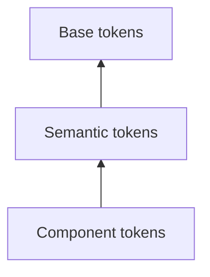

Your design token system is growing. What started with a handful of colors has turned into hundreds of tokens across color, spacing, typography, shadows, and more. Developers are creating tokens like `color.blue-500`, `brandPrimary`, and `text-color-danger`, each following a different pattern. Finding the right token starts to feel more like archaeology than engineering.

This is the problem naming conventions solve. In this article, I'll show you a practical token naming model and how to enforce it with Dispersa's lint system so naming stops depending on code review discipline.

> This convention is a recommendation, not part of the DTCG spec. Dispersa lets you name tokens however you want. The value here is consistency and enforceability.

---

## What Token Naming Is About

Design tokens are the source of truth for design decisions, but they are only useful if people can discover and trust them. When naming is inconsistent, teams run into the same problems repeatedly:

- **Developers can't find existing tokens** and create duplicates instead
- **Token intent is unclear** because names mix implementation and semantics
- **Search stops working well** because similar concepts are named in unrelated ways

A strong naming convention turns a token set into a predictable system. The name tells you what the token is for, what kind of variation it represents, and how it relates to other tokens.

---

## A Three-Tier Naming Model

This article uses a three-tier model:

| Tier          | Purpose                   | Convention     | Example                           |
| ------------- | ------------------------- | -------------- | --------------------------------- |
| **Base**      | Raw values without intent | Type-grouped   | `color.blue-500`                  |
| **Semantic**  | Intent-based, themeable   | Six-layer path | `color.action.brand.hover`        |
| **Component** | UI-mapped, per-component  | Six-layer path | `color.button.primary.background` |

The dependency direction is one-way:



That direction matters. Component tokens should not point directly to base values, or you bypass the semantic layer that makes theming and large-scale refactors safe.

One caveat: not every system needs component tokens. Base and semantic tiers cover most cases. Add component tokens only when a component needs a stable API of its own and that API would otherwise be expressed as repeated semantic aliases scattered across the codebase.

### Base Tokens

Base tokens are descriptive raw values:

```text
color.blue-500
color.gray-900
spacing.md
radius.sm
shadow.md
```

These are not intent-based. They describe what the value is, not what it means in the UI.

### Semantic Tokens

Semantic tokens follow an ordered six-layer path:

```text
category.concept.sentiment.prominence.state.scale
```

| Layer          | Purpose            | Example Values                                     |
| -------------- | ------------------ | -------------------------------------------------- |
| **category**   | Token type         | `color`, `spacing`, `typography`, `shadow`         |
| **concept**    | What it's used for | `text`, `background`, `action`, `border`, `gap`    |
| **sentiment**  | Semantic intent    | `neutral`, `brand`, `danger`, `success`, `warning` |
| **prominence** | Visual emphasis    | `default`, `muted`, `subtle`, `strong`, `inverse`  |
| **state**      | Interaction state  | `hover`, `active`, `focus`, `disabled`, `selected` |
| **scale**      | Size step          | `xs`, `sm`, `md`, `lg`, `xl`, `2xl`                |

Examples:

- `color.text.default`
- `color.action.brand.hover`
- `color.background.danger.subtle`
- `spacing.gap.md`
- `typography.heading.2xl`

Layers can be skipped, but they cannot be reordered. `color.text.danger.muted` is valid. `color.text.muted.danger` is not.

### Component Tokens

Component tokens map semantic decisions onto concrete UI components:

```text
category.component.variant.slot.property.state
```

| Layer         | Purpose        | Example Values                                              |
| ------------- | -------------- | ----------------------------------------------------------- |
| **category**  | Token type     | `color`, `spacing`, `typography`                            |
| **component** | UI component   | `button`, `card`, `input`, `badge`                          |
| **variant**   | Variant/role   | `primary`, `secondary`, `ghost`, `danger`                   |
| **slot**      | Component part | `icon`, `avatar`, `badge`, `label`, `indicator` (any value) |
| **property**  | Style concern  | `background`, `text`, `border`, `padding`                   |
| **state**     | Interaction    | `hover`, `active`, `focus`, `disabled`                      |

Slot is optional. Use it when you are targeting a specific part of a component.

Examples:

- `color.button.primary.background`
- `color.button.primary.background.hover`
- `color.button.primary.icon.background`
- `spacing.button.padding`
- `spacing.card.avatar.padding`
- `color.input.border.focus`

### Key Principles

1. **Intent over implementation**: prefer `color.action.brand` over `color.blue-500`.
2. **Predictability**: if `color.text.default` exists, `color.text.muted` should be guessable.
3. **Orthogonal layers**: sentiment, prominence, state, and scale should not overlap conceptually.
4. **Stable ordering**: layers can be skipped, never reordered.

---

## Mapping the Convention to DTCG JSON

This naming model maps cleanly onto nested DTCG token files:

```json
{
  "color": {
    "text": {
      "$type": "color",
      "$root": { "$value": "{color.gray-900}" },
      "muted": {
        "$root": { "$value": "{color.gray-500}" },
        "disabled": { "$value": "{color.gray-300}" }
      },
      "danger": { "$value": "{color.red-500}" }
    },
    "action": {
      "$type": "color",
      "brand": {
        "$root": { "$value": "{color.blue-500}" },
        "hover": { "$value": "{color.blue-600}" }
      }
    }
  },
  "spacing": {
    "gap": {
      "$type": "dimension",
      "md": { "$value": "{spacing.md}" },
      "lg": { "$value": "{spacing.lg}" }
    }
  }
}
```

When a node needs both its own value and child tokens, use `$root`. Dispersa flattens this structure during parsing, so the effective token paths remain `color.text.muted`, `color.action.brand.hover`, and so on.

---

## Setting Up Dispersa

The fastest way to get started is:

```bash
pnpm create dispersa
```

Choose the **TypeScript** template. Then run:

```bash
pnpm build
```

That gives you a working project and generated output immediately. Next, add linting so naming becomes enforceable instead of advisory.

---

## Enforcing the Convention with Linting

Dispersa exposes linting through the `lint` API and through the `lint` block inside `build()`. For strict enforcement, wire linting directly into your build and let errors fail the build.

It helps to separate two concerns:

- **Source naming**: how tokens are organized and validated in your token graph
- **Output naming**: how those token names are transformed for CSS, JS, iOS, Android, and other platforms

`path-schema` solves the first problem. You may still want a name transform for the second.

### A Strict Build Configuration

```typescript
import path from 'node:path'
import { fileURLToPath } from 'node:url'

import { build, css } from 'dispersa'
import { dispersaPlugin } from 'dispersa/lint'
import { colorToHex, dimensionToRem } from 'dispersa/transforms'

const __dirname = path.dirname(fileURLToPath(import.meta.url))

const pathSchemaSegments = {
  category: {
    values: ['color', 'spacing', 'typography', 'shadow', 'radius'],
  },
  concept: {
    values: ['text', 'background', 'surface', 'action', 'border', 'gap', 'heading', 'body'],
  },
  sentiment: {
    values: ['neutral', 'brand', 'danger', 'success', 'warning', 'info'],
  },
  prominence: {
    values: ['default', 'muted', 'subtle', 'strong', 'inverse'],
  },
  state: {
    values: ['hover', 'active', 'focus', 'disabled', 'selected'],
  },
  scale: {
    values: ['xs', 'sm', 'md', 'lg', 'xl', '2xl'],
  },
  component: {
    values: ['button', 'card', 'input', 'badge'],
  },
  variant: {
    values: ['primary', 'secondary', 'ghost', 'danger'],
  },
  slot: {
    values: [/.*/],
  },
  property: {
    values: ['background', 'text', 'border', 'padding', 'shadow', 'radius', 'gap'],
  },
}

const pathSchemaPatterns = [
  // Base tier
  '{category}.*',

  // Semantic tier
  '{category}.{concept}.{sentiment|prominence|state|scale}?',
  '{category}.{concept}.{sentiment}.{prominence|state}?',
  '{category}.{concept}.{prominence}.{state}?',
  '{category}.{concept}.{sentiment}.{prominence}.{state}',

  // Component tier
  '{category}.{component}.{property}.{state}?',
  '{category}.{component}.{variant}.{property}.{state}?',
  '{category}.{component}.{variant}.{slot}.{property}.{state}?',
]

const result = await build({
  resolver: path.join(__dirname, 'tokens.resolver.json'),
  buildPath: path.join(__dirname, 'output'),
  lint: {
    enabled: true,
    plugins: { dispersa: dispersaPlugin },
    rules: {
      'dispersa/path-schema': [
        'error',
        { segments: pathSchemaSegments, paths: pathSchemaPatterns },
      ],
    },
  },
  outputs: [
    css({
      name: 'tokens',
      file: 'tokens.css',
      preset: 'bundle',
      transforms: [colorToHex(), dimensionToRem()],
    }),
  ],
})
```

This configuration is intentionally strict:

- linting is enabled during the build
- rule severity is set to `error`
- `failOnError` is left at its default of `true`

If a token violates your convention, the build fails.

### Using OR and Optional Without Overfitting

Dispersa's `path-schema` supports optional segments and OR segments, and they are useful when they reduce repetition without making the schema ambiguous.

For the semantic tier, OR and optional markers work well because the vocabularies are distinct. `danger`, `muted`, `hover`, and `2xl` belong to different layers, so a compact pattern set stays readable:

```typescript
;[
  '{category}.{concept}.{sentiment|prominence|state|scale}?',
  '{category}.{concept}.{sentiment}.{prominence|state}?',
  '{category}.{concept}.{prominence}.{state}?',
  '{category}.{concept}.{sentiment}.{prominence}.{state}',
]
```

That reduces redundancy while still preserving the ordering rule.

For component tokens, the example keeps three explicit patterns:

```typescript
;[
  '{category}.{component}.{property}.{state}?',
  '{category}.{component}.{variant}.{property}.{state}?',
  '{category}.{component}.{variant}.{slot}.{property}.{state}?',
]
```

Those three patterns cover the common component shapes while keeping the slot-bearing form explicit.

---

## The Primary Rule

### `path-schema`

`path-schema` enforces structure:

- `segments` defines the vocabulary for each layer
- `paths` defines valid path shapes

Supported syntax includes:

- `{name}` for a required named segment
- `{name}?` for an optional named segment
- `{a|b}` for OR syntax across named segment definitions
- `*` for a wildcard segment

In practice, `path-schema` is the rule that enforces the naming model. If your team already writes lowercase dot-separated token paths consistently, it is often enough for **source-level enforcement** on its own.

What `path-schema` does **not** guarantee is that every output target will want the same naming format. CSS custom properties, JavaScript identifiers, Swift properties, and Android resources all have different ergonomics and constraints. That is where output transforms come in.

---

## What Lint Failure Looks Like

Dispersa's built-in stylish formatter groups issues by token. A real failure looks like this shape:

```text
  color.text.muted.danger
    ✖ error: Token path 'color.text.muted.danger' does not match any defined pattern [dispersa/path-schema]

✖ 1 error
```

That kind of feedback is immediate and actionable. A developer sees the exact offending token and the exact rule that rejected it.

---

## CLI Workflow

Everything shown above is also available through the CLI if you prefer a config-first workflow.

Put the same `lint` block into `dispersa.config.ts`, then run:

```bash
dispersa build
```

or lint independently with:

```bash
dispersa lint
```

That gives you the same `path-schema` enforcement without having to call `build()` or `lint()` directly from a TypeScript script.

---

## CI Enforcement

Once naming is encoded as lint rules, CI becomes straightforward:

```typescript
import { lint } from 'dispersa'
import { dispersaPlugin } from 'dispersa/lint'

// Reuse the same pathSchemaSegments and pathSchemaPatterns
// from the build example above.

const result = await lint({
  resolver: './tokens.resolver.json',
  plugins: { dispersa: dispersaPlugin },
  rules: {
    'dispersa/path-schema': ['error', { segments: pathSchemaSegments, paths: pathSchemaPatterns }],
  },
})
```

`lint()` throws on errors by default, so this is already CI-ready. If your build process runs `pnpm build`, putting linting inside `build()` is usually even better because the enforcement lives in one place.

If you are publishing CSS, Tailwind config, Kotlin, Swift, or JS modules from the same token source, keep the distinction clear:

- lint rules enforce your **canonical token structure**
- transforms adapt token names for each **target platform**

---

## Where to Start

If you're introducing conventions into an existing token system, don't try to model every edge case on day one.

Start with:

1. one stable base naming convention
2. `path-schema` for structure
3. CI enforcement once the team agrees on the vocabulary

The important shift is this: naming should stop being a style preference and become executable policy.

---

## Wrapping Up

A naming convention only pays off when it is enforced. With Dispersa's lint system, you can encode both formatting rules and structural rules directly into your build pipeline.

That gives you:

- **Automated enforcement** instead of manual review
- **Clear failure modes** when tokens violate the convention
- **A scalable vocabulary** for semantic and component tokens
- **Safer system growth** as more contributors touch the token set

If you want to experiment with this locally, start with:

```bash
pnpm create dispersa
```

Then add `path-schema`, wire it into your build, and let the build fail when someone breaks the contract.
